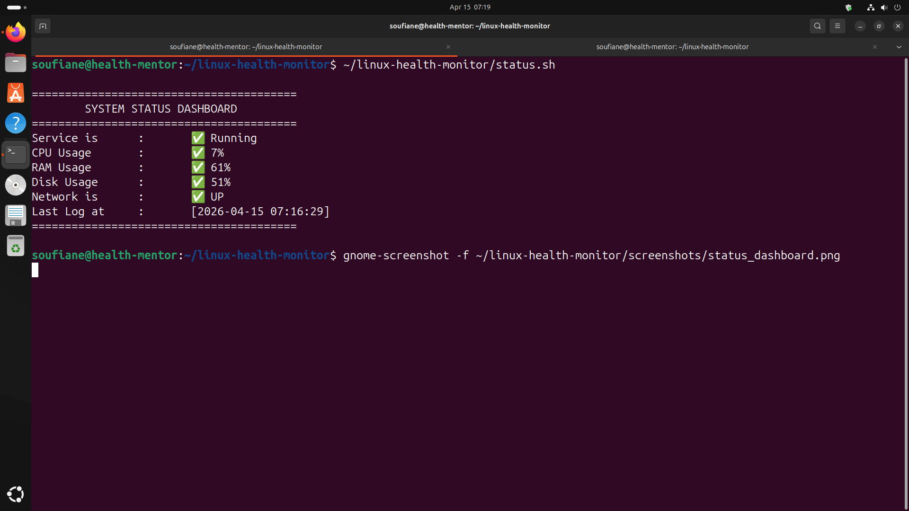
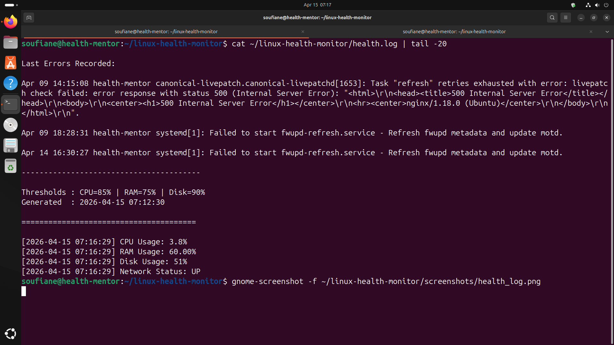
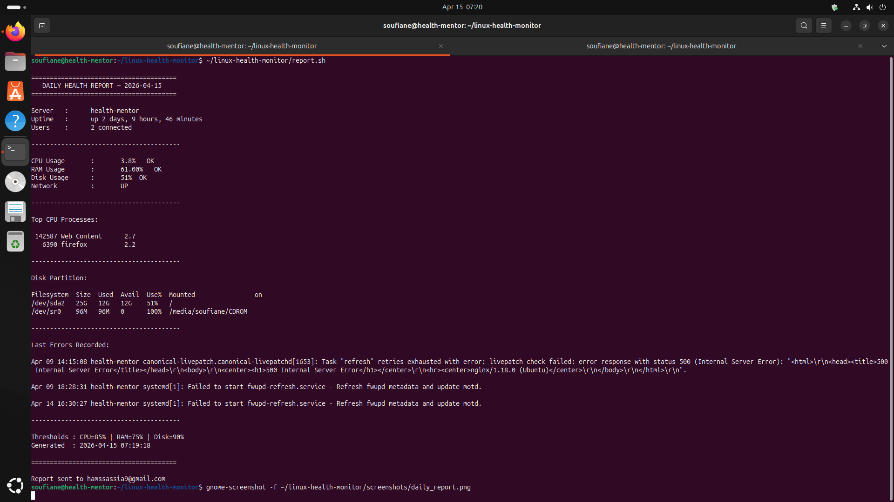
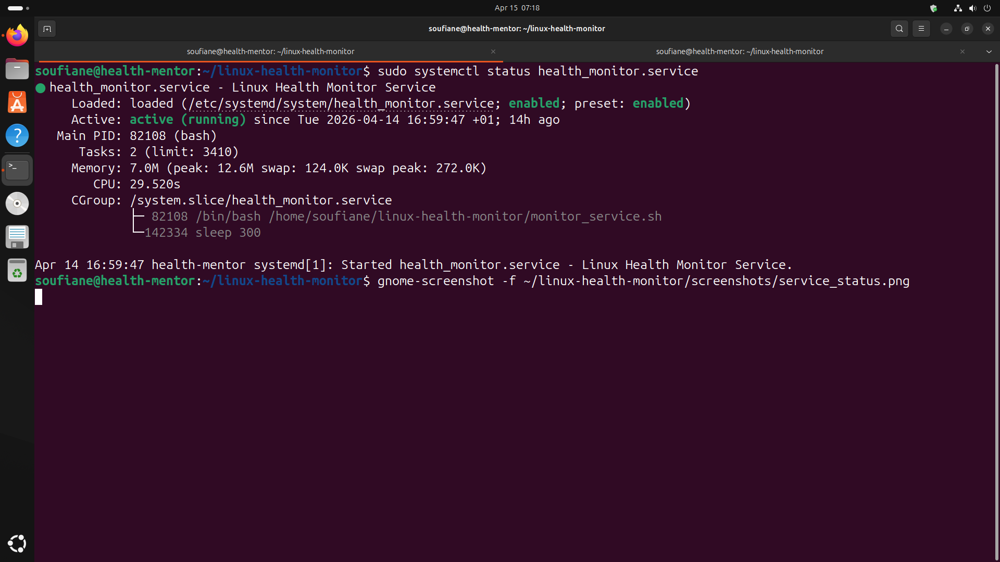

 # Linux Health Monitor

Automated system health monitoring solution for Linux servers.
Built by **Soufiane Hamssassia** — IT Support & Network Admin

---

## What it does

- Monitors **CPU**, **RAM**, **Disk**, and **Network** every 5 minutes via systemd service
- Logs all results with timestamps to `health.log`
- Sends **real-time email alerts** via Gmail SMTP when thresholds are exceeded
- Generates a **daily health report** sent by email every evening
- Performs **security audits** and **log analysis** on demand
- Rotates logs daily with automatic 7-day cleanup
- Includes an **interactive menu** and **status dashboard**
- Manages **users and groups** with email notifications

---

## Project Structure

\`\`\`

`linux-health-monitor/
├── config.cfg                  # Centralized config (thresholds, email, log path)
├── health_monitor.sh           # Main orchestrator script
├── monitor_checks.sh           # Unified CPU/RAM/Disk/Network monitor
├── monitor_service.sh          # Systemd service loop script
├── health_monitor.service      # Systemd service unit file
├── health_report.service       # Daily report service unit
├── health_report.timer         # Daily report timer (20:00)
├── monitor_service.service     # Alternative service unit
├── report.sh                   # Daily health report generator
├── log_analyzer.sh             # Log analysis and security report
├── security_audit.sh           # Full system security audit
├── status.sh                   # System status dashboard
├── menu.sh                     # Interactive health monitor menu
├── user_manager.sh             # User/group management tool
├── rotate_log.sh               # Log rotation with archiving
├── cpu_check.sh                # CPU usage monitor
├── ram_check.sh                # RAM usage monitor
├── disk_check.sh               # Disk usage monitor
├── network_check.sh            # Network connectivity monitor
├── screenshots/                # Sample output screenshots
└── README.md`
\`\`\`

---

## Setup

### 1. Clone the repo
\`\`\`bash
git clone git@github.com:HSfina/linux-health-monitor.git
cd linux-health-monitor
chmod +x *.sh
\`\`\`

### 2. Configure email alerts
\`\`\`bash
sudo apt install msmtp msmtp-mta -y
\`\`\`

Create `~/.msmtprc` :
\`\`\`
defaults
auth           on
tls            on
_tls_trust_file /etc/ssl/certs/ca-certificates.crt
logfile        ~/.msmtp.log

account        gmail
host           smtp.gmail.com
port           587
from           hamssassia9@gmail.com
user           hamssassia9@gmail.com
password       **Secret**

account default : gmail
\`\`\`
\`\`\`bash
chmod 600 ~/.msmtprc
\`\`\`

### 3. Edit config.cfg
\`\`\`bash
vim config.cfg
\`\`\`
\`\`\`
`CPU_THRESHOLD=85
RAM_THRESHOLD=75
DISK_THRESHOLD=90
EMAIL="hamssassia9@gmail.com"
LOGFILE=~/linux-health-monitor/health.log`
\`\`\`

### 4. Set up cron jobs
\`\`\`bash
crontab -e
\`\`\`
\`\`\`
`0 * * * *  /bin/bash /home/soufiane/linux-health-monitor/health_monitor.sh
0 0 * * *  /bin/bash /home/soufiane/linux-health-monitor/rotate_log.sh`
\`\`\`

---

## Systemd Service

\`\`\`bash
`sudo cp health_monitor.service /etc/systemd/system/
sudo systemctl daemon-reload
sudo systemctl enable health_monitor
sudo systemctl start health_monitor`
\`\`\`

\`\`\`bash
`sudo systemctl status health_monitor    # Check status
sudo systemctl stop health_monitor      # Stop
sudo systemctl restart health_monitor   # Restart
journalctl -u health_monitor -f         # Live logs`
\`\`\`

---

## Daily Report Timer

\`\`\`bash
`sudo cp health_report.service health_report.timer /etc/systemd/system/
sudo systemctl daemon-reload
sudo systemctl enable --now health_report.timer
sudo systemctl list-timers`
\`\`\`

---

## Screenshots

### System Status Dashboard

### Health Monitor Log

### Daily Report

### Systemd Service Status

---

## Configuration
`
| Parameter | Default | Description |
|---|---|---|
| CPU_THRESHOLD | 85% | CPU alert trigger |
| RAM_THRESHOLD | 75% | RAM alert trigger |
| DISK_THRESHOLD | 90% | Disk alert trigger |
| EMAIL | hamssassia9@gmail.com | Alert recipient |
| Cron health | Every hour | Check frequency |
| Cron rotate | Every midnight | Log rotation |
| Service interval | 5 minutes | Systemd check frequency |
`
---

## Skills Demonstrated

- Bash scripting (variables, conditions, loops, functions)
- Linux system administration (users, groups, permissions, ACL)
- Systemd service and timer configuration
- Cron job scheduling
- SMTP email configuration (msmtp/Gmail)
- Log analysis and security auditing
- Git & GitHub version control
- Technical documentation
